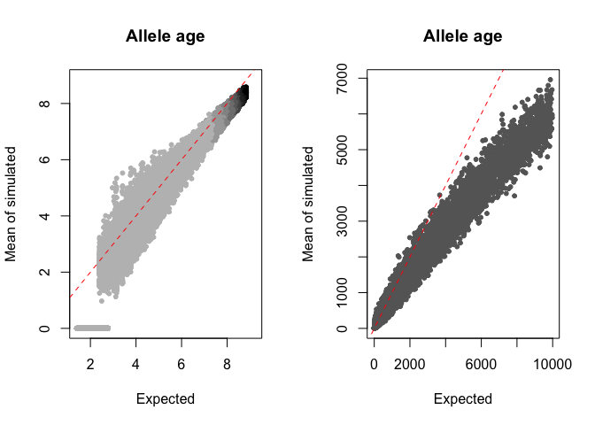
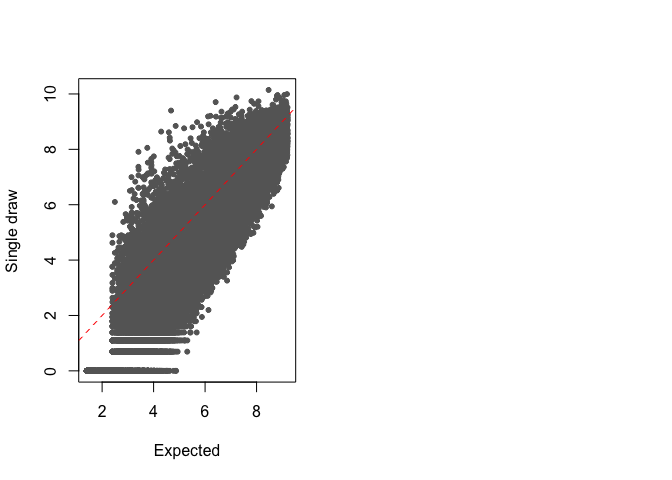
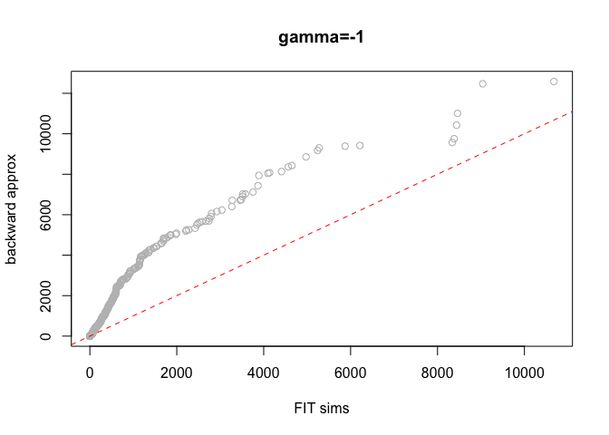
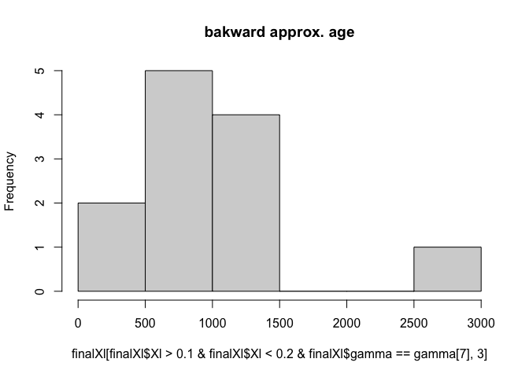

Simulate Allele Age
================
7/26/2021

## Imports

``` r
library(Rcpp)
library(expint)
library(MASS)
library(gplots)
```

    ## 
    ## Attaching package: 'gplots'

    ## The following object is masked from 'package:stats':
    ## 
    ##     lowess

*All calculations below are per-site/locus, \(l\). Will port this into a
global meta-function for ease of use later.*

## Picking \(\gamma\)

Here, I pick the population scaled selection coefficient
\(\gamma = 2Ns \in [-100, -0.01]\) to then use for simulating allele
frequency \(X\). Assumes a selection parameterization of
\(1, 1+\frac{1}{2}s, 1+s\).

``` r
N<-2500 # inds
# initial: need a total of 5000 training data sets: 50 selection values on either side + 0 with 100 instances of allele frequencies
L<-200 

# just pick a grid of values here, say, ~50
gamma<-c(-exp(log(10)*seq(2, -2, length.out=25)))#,exp(log(10)*seq(-2, 2, length.out=25)))
```

## Simulating \(X_l\)

Below, I will use the above \(\gamma_l\) value to simulate a starting
allele frequency (present-day, \(X_0\)), and then let the population
evolve (to either extinction or fixation). Formula 7.61 of Durrett 2008:
\[f(X_l | \gamma_l) = \frac{1}{X_l(1-X_l)}\frac{1-e^{-2\gamma_l(1-X_l)}}{1-e^{-2\gamma_l}}\]

We need to normalize this function by dividing by
\(\int_{1/4N}^{1-1/4N} f(X_l | \gamma_l) dX_l\) to convert it to a PDF
\(P(X_l | \gamma_l)\).

Using this likelihood, I can get the value of \(X_l\) by normalizing and
doing inverse transform sampling. From WolframAlpha, the integral (also
CDF) solves out to be
\[F_{X_l}(y)=\frac{1}{1-e^{-\gamma}}\times[\text{Ei}(\gamma_l(y-1)) - e^{-\gamma}\text{Ei}(\gamma_l y) - \log(y-1) + \log y]\]

Revised formula:
\[F_{X_l}(y)=\frac{1}{e^{2\gamma}-1}\times[e^{2\gamma}\text{Ei}(2\gamma(y-1)) - \text{Ei}(2\gamma y) - e^{2\gamma}\log(1-y) + e^{2\gamma}\log y]\]

The following code chunk needs to be repeated for every value of
\(\gamma\).

``` r
Xl<-(1:(4*N-1))/(4*N)
estimXl<-function(Xl, gamma, ndraws){
    finalXl<-rep(0,length(gamma)*ndraws)
    for(n in 1:length(gamma)){
        lbscal<-expint_Ei(2*gamma[n]*(Xl[1]-1)) - exp(-2*gamma[n])*expint_Ei(2*gamma[n]*Xl[1]) - log(1-Xl[1]) + log(Xl[1])
        scal.fact<-(expint_Ei(2*gamma[n]*(Xl[length(Xl)]-1)) - exp(-2*gamma[n])*expint_Ei(2*gamma[n]*Xl[length(Xl)]) - log(1-Xl[length(Xl)]) + log(Xl[length(Xl)])) - lbscal
        
        pXl<-(expint_Ei(2*gamma[n]*(Xl-1)) - exp(-2*gamma[n])*expint_Ei(2*gamma[n]*Xl) - log(1-Xl) + log(Xl) - lbscal)/scal.fact # exp(2*gamma[n])/(exp(2*gamma[n])-1) gets cancelled out from num and den...
        
        u<-runif(ndraws, 0, 1)
        finalXl[((n-1)*ndraws+1):(n*ndraws)]<-Xl[sapply(u,function(x){which.min(abs(pXl-x))})]
    }
    return(finalXl)
}

system.time(finalXl<-estimXl(Xl,gamma,ndraws=1000))
```

    ##    user  system elapsed 
    ##   1.098   0.648   1.793

Now, I have to add an extra column indicating the \(\gamma\) value for
each row (i.e., frequency).

``` r
finalXl<-cbind(finalXl, rep(gamma,1, each=1000))
colnames(finalXl)<-c("Xl","gamma")
```

### Miscellaneous

Testing bed for R function:

``` r
# need a scal.fact for each gamma value 
scal.fact<-(expint_Ei(gamma*(Xl[length(Xl)]-1)) - exp(-gamma)*expint_Ei(gamma*Xl[length(Xl)]) - log(1-Xl[length(Xl)]) + log(Xl[length(Xl)])) -
    (expint_Ei(gamma*(Xl[1]-1)) - exp(-gamma)*expint_Ei(gamma*Xl[1]) - log(1-Xl[1]) + log(Xl[1]))

# compute CDF 
pXl<-(expint_Ei(gamma[2]*(Xl-1)) - exp(-gamma[2])*expint_Ei(gamma[2]*Xl) - log(1-Xl) + log(Xl)) -
    (expint_Ei(gamma[2]*(Xl[1]-1)) - exp(-gamma[2])*expint_Ei(gamma[2]*Xl[1]) - log(1-Xl[1]) + log(Xl[1]))
# normalize to 0-1 scale
pXl<-pXl/scal.fact

# generate a set of random numbers between 0 and 1 for inverse transform sampling
u<-runif(2000,0,1)
# find closest pXl value and map back to corresponding Xl
Xl.dist<-Xl[which.min(abs(pXl-u))]
```

The following code is \~6x slower than the vectorized R code *cry*

``` cpp
#include <Rcpp.h>
using namespace Rcpp;

// [[Rcpp::export]]
NumericVector estimXlcpp(NumericVector Xl, NumericVector gamma, int ndraws){
    int lenXl = Xl.size();
    int nGamma = gamma.size();
    
    NumericVector eXl(nGamma);
    
    NumericVector pXl(lenXl);
    NumericVector u(ndraws);
    
    NumericVector finalXl(nGamma*ndraws);
    
    Function e("expint_Ei");
    
    double scalFact = 1.0;
    double lbscal;
    
    for(int n=0; n<nGamma; n++){
        lbscal = Rcpp::as<double>(e(gamma[n]*(Xl[0]-1))) - std::exp(-gamma[n])*Rcpp::as<double>(e(gamma[n]*Xl[0])) - std::log(1-Xl[0]) + std::log(Xl[0]);
        scalFact = Rcpp::as<double>(e(gamma[n]*Xl[lenXl-1])) - std::exp(-gamma[n])*Rcpp::as<double>(e(gamma[n]*Xl[lenXl-1])) - std::log(1-Xl[lenXl-1]) + std::log(Xl[lenXl-1]) - lbscal;
    
        for(int i=0; i<lenXl; i++){
            pXl[i] = (Rcpp::as<double>(e(gamma[n]*(Xl[i]-1))) - std::exp(-gamma[n])*Rcpp::as<double>(e(gamma[n]*Xl[i])) - std::log(1-Xl[i]) + std::log(Xl[i]) - lbscal)/scalFact;
        }
        u = Rcpp::runif(ndraws, 0, 1);
        
        for(int m=0; m<ndraws; m++){
            finalXl[m+n*ndraws] = Xl[which_min(abs(pXl-u[m]))];
        }
    }
    
    return finalXl;
}
```

## Obtaining \(a_l\)

Here, I will use the \(X_0\) as the starting frequency and run WF sims
until it reaches a frequency of \(<1/2N\) – record this generation as
the allele age. This formula is similar to equations found in Ewens 2007
for conditional processes in diffusion theory conditional on fixation
(here, we condition on loss).

\[
X_{t+1} | X_t, \gamma \sim N(\mu_s, V_s) \\
[[\mu* = -\frac{1}{2}sx(1-x)\coth(\frac{s}{2}(1-x))]]\\
\mu_s = X_t - \frac{\gamma X_t (1-X_t)}{4N \tanh (\frac{\gamma}{4N}(1-X_t))} \\
V_s = X_t(1-X_t)
\]

Prototype R function below:

``` r
alleleAge<-function(X0, gamma, N){
    gen<-0
    Xt<-X0
    # quit loop and record allele age if it dips below 1/2N
    while(Xt>0.5/N){
        gen<-gen+1
        
        mu<-Xt-0.25*gamma*Xt*(1-Xt)*coth(0.5*gamma*(1-Xt))/N
        
        Xt<-rnorm(1, mean=mu, sd=sqrt(Xt*(1-Xt))*0.5/N)
    }
    return(gen)
}
```

I will run the below function for each of our training data points
(\~25k) to get allele age given \(\gamma\) and \(X_l\). Thankfully, this
Rcpp function runs \~30x faster than the regular R function.

``` cpp
#include <Rcpp.h>
using namespace Rcpp;

// [[Rcpp::export]]
int alleleAgecpp(float X0, float gamma, int N){
    int gen = 0;
    double Xt = X0;
    double mu = 0.0;
    
    while(Xt > 0.5/N){
        gen++;
        
        mu = Xt - 0.25*gamma*Xt*(1-Xt)/tanh(0.25*gamma*(1-Xt))/N;
        Xt = R::rnorm(mu, sqrt(Xt*(1-Xt)*0.5/N));
    }  
    
    return gen;
}
```

Time to farm out the above function to each row in the previous data
frame:

``` r
all.age<-apply(finalXl, 1, function(x) alleleAgecpp(x[1], x[2], N))
finalXl<-cbind(finalXl, all.age)
colnames(finalXl)[3]<-"al"
finalXl[all.age==0,3]<-finalXl[all.age==0,3]+1
```

Below code will compute the empirical expectation of the allele age over
multiple (say, 50) realizations of the FIT simulations.

``` r
mean.all.age<-apply(finalXl, 1, function(x) mean(replicate(50, alleleAgecpp(x[1], x[2], N))))
mean.all.age[mean.all.age==0]<-1
```

Obtain 200 samples from simulations for each pair and store it in a text
file: to construct ECDF and check results with predictions with neural
net.

``` r
sims.all.age<-apply(finalXl, 1, function(x) replicate(200, alleleAgecpp(x[1], x[2], N)))
```

Plotting a few example ECDFs and writing into a file:

``` r
par(mfrow=c(2,1))
plot(ecdf(sims.all.age[,123]), col="grey40")
text(max(sims.all.age[,123]),0.1, labels=paste0("Xl=",finalXl[123,1],"\ngamma=",finalXl[123,2]))

# plot(ecdf(sims.all.age[,45678]), col="grey40")
# text(max(sims.all.age[,45678]),0.1, labels=paste0("Xl=",finalXl[45678,1],"\ngamma=",finalXl[45678,2]))
# 
write.matrix(sims.all.age,file=paste0("traindata/sims-",Sys.Date(),".csv"),sep=",")
```

<!-- -->

Writing into a file as training data:

``` r
write.matrix(finalXl,file=paste0("traindata/trip-",Sys.Date(),".csv"),sep=",")
```

## Comparison between theory and empirical draws

Below, I will compare the expectation for allele age from diffusion
theory for \(h=1/2\) from Ewens 2008 (Eqn 5.54) for eventual loss of an
allele, starting at initial frequency of \(p\).

\[
t^{**}(x;p) = 2\{e^{\gamma x}-1 \} \{e^{\gamma (1-x)}-1\}[\gamma x(1-x) (e^\gamma-1)]^{-1}
\]

Need to take the expectation of the above function between \(1/2N\) and
\(p=X_l\), to find the actual expected allele age.

\[
\bar t^{**}(p) = \int_{x_1}^{x_2} t^{**}(x; p) dx \\
\bar t^{**}(p) = \int_{1/2N}^{p} 2\{e^{\gamma x}-1 \} \{e^{\gamma (1-x)}-1\}[\gamma x(1-x) (e^\gamma-1)]^{-1} dx + \\ \int_p^{1-1/2N} 2e^{-\gamma(1-x)} \{1-e^{-\gamma p}\}\{e^{\gamma(1-x)}-1\}^2 \times[\gamma x(1-x)(1-e^{-\gamma})(e^{\gamma(1-p)}-1)]^{-1}dx
\]

Using Mathematica, the expected value (from the definite integral)
turned out to be:

``` r
knitr::include_graphics("12ntop.png", error=FALSE)
```

<div class="figure">


<p class="caption">

From 1/2N to p

</p>

</div>

``` r
knitr::include_graphics("pto12n.png")
```

<div class="figure">


<p class="caption">

From p to 1-1/2N

</p>

</div>

``` r
exp.al<-function(p, gamma, N){
    # term1<--exp(gamma)*expint_Ei(gamma*(p-1)) + exp(gamma)*expint_Ei(-gamma*p) + expint_Ei(gamma*p) - expint_Ei(gamma*(1-p)) + (1+exp(gamma))*(log(1-p)-log(p))
    # term2<--exp(gamma)*expint_Ei(gamma*(0.5/N-1)) + exp(gamma)*expint_Ei(-gamma*0.5/N) + expint_Ei(gamma*0.5/N) - expint_Ei(gamma*(1-0.5/N)) + (1+exp(gamma))*(log(1-0.5/N)-log(0.5/N))
    # term3<--exp(gamma)*expint_Ei(-gamma*0.5/N) + exp(2*gamma)*expint_Ei(-gamma*(N-0.5)/N) + expint_Ei(gamma*(N-0.5)/N) - exp(gamma)*expint_Ei(gamma*0.5/N) + 2*exp(gamma)*(log(0.5/N)-log((N-0.5)/N))
    # term4<--exp(gamma)*expint_Ei(gamma*(p-1)) + exp(2*gamma)*expint_Ei(-gamma*p) + expint_Ei(gamma*p) - exp(gamma)*expint_Ei(gamma*(1-p)) + 2*exp(gamma)*(log(1-p)-log(p))
    
    term1<-exp(gamma)*expint_Ei(gamma*(p-1)) - exp(gamma)*expint_Ei(-gamma*p) - expint_Ei(gamma*p) + expint_Ei(gamma*(1-p)) + (1+exp(gamma))*(log(p)-log(1-p))
    term2<-exp(gamma)*expint_Ei(gamma*(0.25/N-1)) - exp(gamma)*expint_Ei(-gamma*0.25/N) - expint_Ei(gamma*0.25/N) + expint_Ei(gamma*(1-0.25/N)) + (1+exp(gamma))*(log(0.25/N)-log(1-0.25/N))
    term3<--exp(gamma)*expint_Ei(-gamma*0.25/N) + exp(2*gamma)*expint_Ei(-gamma*(1-0.25/N)) + expint_Ei(gamma*(N-0.25)/N) - exp(gamma)*expint_Ei(gamma*0.25/N) + 2*exp(gamma)*(log(0.25/N)-log(1-0.25/N))
    term4<--exp(gamma)*expint_Ei(gamma*(p-1)) + exp(2*gamma)*expint_Ei(-gamma*p) + expint_Ei(gamma*p) - exp(gamma)*expint_Ei(gamma*(1-p)) + 2*exp(gamma)*(log(1-p)-log(p))
    
    
    return(2*(term1-term2)/(gamma*expm1(gamma)) - 2*expm1(gamma*p)*(term4-term3)/(gamma*expm1(gamma)*(exp(gamma)-exp(gamma*p))))
}

finalXl<-cbind(finalXl, apply(finalXl, 1, function(x){exp.al(x[1], x[2], N)}))
finalXl[,4]<-apply(finalXl, 1, function(x){exp.al(x[1], x[2], N)})
colnames(finalXl)[4]<-"exp.al"
finalXl[,4]<-finalXl[,4]*2*N
```

Below I plot the mean of the simulations versus the expected allele ages
from theory (points colored based on frequency:

``` r
rbPal <- colorRampPalette(c('grey','black'))
par(mfrow=c(1,2))
plot(log(finalXl[,4]),log(mean.all.age),pch=20,xlab="Expected",ylab="Mean of simulated",main="Allele age",col=rbPal(10)[as.numeric(cut(abs(finalXl[,1]),breaks = 20))])
abline(0,1,col='red',lty=2)
plot(finalXl[,4],mean.all.age,pch=20,xlab="Expected",ylab="Mean of simulated",main="Allele age",col='grey40')
abline(0,1,col='red',lty=2)
```

<!-- -->

``` r
plot(log(finalXl[,4]),log(finalXl[,3]),pch=20,col='grey40',xlab='Expected',ylab='Single draw')
abline(0,1,col='red',lty=2)
```

<!-- -->

There is quite a good correlation (\~0.97) between mean allele age (from
50 sims) and 1 random draw from the distribution.

``` r
plot(mean.all.age,all.age,pch=20,col="grey40")
abline(0,1,col="red",lty=2)
```

<!-- -->

## Obtaining likelihood estimates

Below, I will find likelihood values for \(\mathcal{L}(\gamma \vert X)\)
and \(\mathcal{L}(\gamma \vert X, a)\) to obtain increase in accuracy of
estimation (quantified using Fisher information matrix?)

*Picking a \(\gamma=-10\)*

Remember: for a range of observations/frequencies
\(X_1, X_2, \ldots, X_n\) then
\(\log \mathcal{L}(\gamma \vert \mathbf{X}) = \sum_{i=1}^n \log {L}(\gamma \vert X_i)\)

``` r
# getting the data (i.e., subsetting for the appropriate value of gamma)
Xlred<-exp(preds[preds$V2==-10,1])
logal.mured<-log(preds[preds$V2==-10,3])
logal.sdred<-preds[preds$V2==-10,4]
```

``` r
# function to obtain/plot likelihood values for a range of gamma, given a a set of freqs Xl
# (take the ratio first and then log)
plot_loglik_xl<-function(gamma, xl){
    sapply(gamma, function(g){sum(log((1-exp(-2*g*(1-xl)))/(1-exp(-2*g))))}) - sum(log(xl)) - sum(log(1-xl))
}
```

Need predictions from other values of gamma and Xl as well…

``` r
# pass in with same order of Xl and gamma
plot_loglik_al<-function(al, al.mu, al.sd){
    sapply(gamma, function(g){sum(dnorm(log(al),al.mu,al.sd,log=T))})
}
```

## Resimulating using forward equations

Below, I will run the sims with start freq \(X_0 = 1/2N\) and record
allele ages at random intervals.

\[X_{t+1} \vert X_t \sim \mathcal{N}(\mu_s, V_s) \\
\mu_s = X_t + \frac{\gamma X_t (1-X_t)}{4N-2\gamma(1-X_t)} \\
V_s = X_t(1-X_t)\]

``` cpp
#include <Rcpp.h>
using namespace Rcpp;

// [[Rcpp::export]]
NumericMatrix getAlleleAgecpp(float gamma, int N, int ndraws){
    int gen;
    IntegerVector lky; 
    int i = 0;
    double Xt = 0.5/N;
    double mu = 0.0;
    
    NumericVector sim(50000);
    
    NumericVector age(ndraws); 
    NumericVector Xl(ndraws);
    
    while(i < ndraws){
        Xt = 0.5/N;
        std::fill(sim.begin(), sim.end(), 0);
        for(gen=1; gen<50000; gen++){
            mu = Xt + 0.25*gamma*Xt*(1-Xt)/N;
            Xt = R::rnorm(mu, sqrt(Xt*(1-Xt)*0.5/N));
            
            sim[gen] = Xt; 
            
            if(Xt < 0.5/N || Xt > 1-0.5/N)
                break;
        }
        if(gen > 5){
            lky = Rcpp::sample(gen-1, 1);
            age[i] = lky[0];
            Xl[i] = sim[lky[0]];
            i++;
        }
    }
    
    NumericMatrix ret(ndraws, 2); 
    ret(_,0) = Xl;
    ret(_,1) = age;
    
    return ret;
}
```

``` r
    restart:
    Xt = 0.5/N;
    for(gen=1; gen<50000; gen++){
        mu = Xt + 0.25*gamma*Xt*(1-Xt)/N;
        Xt = R::rnorm(mu, sqrt(Xt*(1-Xt)*0.5/N));
        
        if(Xt < 0.5/N)
            goto restart;
        
        if(gen>50 && R::rbinom(1,0.05)){
            age[i] = gen;
            Xl[i] = Xt;
            
            if(i<ndraws)
                i++;
            else
                break;
        }
    }
```

Below, I will get the \((X_l, a_l)\) combination for each value of
\(\gamma\).

``` r
newfinalXl<-finalXl
newfinalXl[,2]<-rep(gamma,1,each=1000)
for(n in 1:length(gamma)){
    newfinalXl[((n-1)*1000+1):(n*1000),c(1,3)]<-getAlleleAgecpp(gamma[n], N, 1000)
}
hist2d(log10(newfinalXl[,1]),log10(newfinalXl[,3]),nbins=c(50,50),xlab='log-freq',ylab='log-age')
```

### Combining three data sets into a final training data set

Below I will combine with 400/300/300 on the 5/50/500 gens data sets.

``` r
final.data<-matrix(0, nrow=nrow(newfinalXl), 3)
for(n in 1:length(gamma)){
    final.data[((n-1)*1000+1):(n*1000),]<-rbind(
        newfinalXl[newfinalXl[,2]==gamma[n],][sample(1:1000,400),1:3],
        newfinalXl50[newfinalXl50[,2]==gamma[n],][sample(1:1000,300),1:3],
        newfinalXl500[newfinalXl500[,2]==gamma[n],][sample(1:1000,300),1:3])
}
colnames(final.data)<-c("Xl","gamma","al")
# most data points at low freqs and low ages but good spread...
hist2d(log10(final.data[,1]),log10(final.data[,3]),nbins=c(50,50),xlab='log-freq',ylab='log-age')
```

Comparing with expectation from the integral of the PDF:

*(correlation is \~0.74, some outliers in the simulated but that’s
expected…(however, simulated is 2x - variance is high?)*

``` r
final.data<-cbind(final.data, apply(final.data, 1, function(x){c(x[1], x[2], N)}))
colnames(final.data)[4]<-"exp.al"
final.data[,4]<-final.data[,4]*2*N
plot(log(final.data[,4]),log(final.data[,3]),pch=20,col="grey40",ylab="Simulated",xlab="Expected",main="Allele age")
```

Writing data out into a text file:

``` r
write.matrix(final.data,file=paste0("traindata/trip-",Sys.Date(),".csv"),sep=",")
```

### Comparing between the two methods for simulation

Reading in simulated data from before:

``` r
newfinalXl<-read.csv("traindata/trip-2021-08-25.csv")
```

Method: For a given freq in the FIT sims find a freq(s) that is close to
the given and compare the allele ages between the two. Do this
separately for each selection coefficient \(\gamma\).

``` r
# comparisons for gamma=-10
didx<-matrix(nrow=1000,ncol=2)
for(i in 1:1000){
    startidx<-6000 # for gamma=-10
    didx[i,1]<-which.min(abs(newfinalXl[newfinalXl$gamma==-10,1]-finalXl[i,1])) + startidx
    didx[i,2]<-min(abs(newfinalXl[newfinalXl$gamma==-10,1]-finalXl[i,1]))
}
plot(finalXl[finalXl$gamma==gamma[7],3],newfinalXl[didx,3],pch=20,xlab='Backward approx',ylab='FIT',main='Estimated allele age for similar freq & gamma=-10',col=rbPal(10)[cut(log(didx[,2]),breaks = 10)])
```

``` r
finalXl<-as.data.frame(finalXl)
plot(sort(newfinalXl[newfinalXl$gamma==-10,1]), sort(finalXl[finalXl$gamma==gamma[7],1]), col='grey', main=paste0("Xl, gamma=",gamma[7]), ylab="backward approx", xlab="FIT sims")
abline(0,1,col='red',lty=2)
```

<!-- -->

``` r
plot(sort(newfinalXl[newfinalXl$gamma==-10,3]), sort(finalXl[finalXl["gamma"]==gamma[7],3]), col='grey', main=paste0("al, gamma=",gamma[7]), ylab="backward approx", xlab="FIT sims")
abline(0,1,col='red',lty=2)
```

<!-- -->

``` r
plot(sort(newfinalXl[newfinalXl$gamma==-0.2154435,1]), sort(finalXl[finalXl$gamma==gamma[17],1]), col='grey', main=paste0("Xl, gamma=",gamma[17]), ylab="backward approx", xlab="FIT sims")
```

<!-- -->

``` r
plot(sort(newfinalXl[newfinalXl$gamma==-0.2154435,3]), sort(finalXl[finalXl$gamma==gamma[17],3]), col='grey', main=paste0("al, gamma=",gamma[17]), ylab="backward approx", xlab="FIT sims")
```

<!-- -->

``` r
hist(finalXl[finalXl$Xl>0.1&finalXl$Xl<0.2&finalXl$gamma==gamma[7],3],main='bakward approx. age')
```

<!-- -->

``` r
hist(newfinalXl[newfinalXl$Xl>0.1&newfinalXl$Xl<0.2&newfinalXl$gamma==-10,3],col='grey',main='FIT sim. age')
```

<!-- -->
